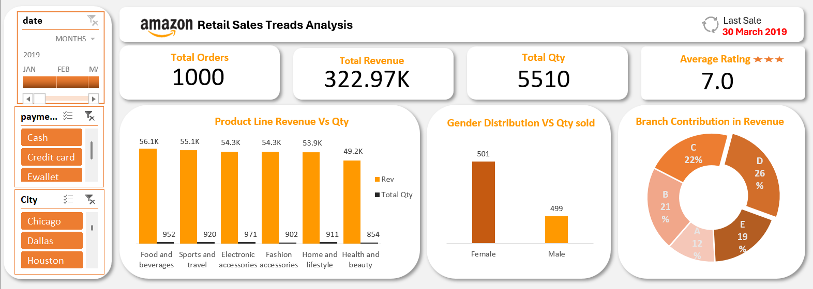

# 🛍️ Amazon Retail Sales Analysis using Excel  

**Project Description:**  
This project analyzes Amazon retail sales data for three months (January–March) using Microsoft Excel.  
The goal is to understand revenue trends, branch performance, product profitability, and customer purchase patterns.
The analysis helps identify which areas drive the most sales and profit, supporting better business and marketing decisions.

---

## Project Objective
To perform a detailed **Exploratory Data Analysis (EDA)** on Amazon sales data and identify:
- Which **branches and product lines** generate the highest revenue and profit  
- How **monthly and time-based trends** impact sales performance  
- The **relationship between customer demographics**, payment methods, and spending  
- Actionable insights to improve profitability and customer experience


---

## Dataset Description  
- **Duration:** January 2019 – March 2019  
- **Total Records:** 1,000 transactions  

**Key Columns:**
- `Invoice ID` – Unique identifier for each transaction  
- `Branch` – Store location (A, B, C, D or E)  
- `Gender` – Customer gender 
- `Product Line` – Category of product sold  
- `Quantity` – Number of items purchased  
- `Unit Price` – Price per item  
- `Total` – Total transaction amount  
- `Date` – Transaction date  
- `Payment` – Mode of payment (Cash, E-wallet, Credit Card)  
- `Rating` – Customer satisfaction rating (out of 10)  

---

## Tools Used
| Tool | Purpose |
|------|----------|
| **Microsoft Excel** | Data cleaning, pivot analysis, and visualization |
| **Power Query** | Data transformation and preprocessing |
| **Pivot Tables & Charts** | Exploratory analysis and trend identification |

---

## Repository Structure  

This repository is organized for clarity and ease of understanding.  
Each folder serves a specific purpose in the analysis process:  


```plaintext
Amazon-Retail-Sales-Analysis/
│
├──  data/
│   ├── data.csv → Original raw dataset
│   ├── processed_data.csv → Cleaned and transformed dataset (via Power Query)
│
├──  excel/
│   ├── amazon_retail_dataset.xlsx → Main Excel workbook containing:
│       - KPI calculations  
│       - Pivot tables  
│       - Dashboard worksheet  
│
├──  dashboard.png → Screenshot of the final Excel dashboard 
│    
│
├── README.md → Complete project documentation
```

### Description
- The **data** folder contains both the raw and processed data files used for the analysis.  
- The **excel** folder includes the working Excel file with all formulas, pivots, and visual elements.  
- The **reports** folder stores the exported dashboard image for quick viewing.  
- The **README.md** serves as your main project guide, outlining objectives, insights, and key findings.  

---

## Key Metrics / KPIs  
- **Total Revenue**  
- **Total Quantity Sold**  
- **Average Rating**  
- **Branch-wise Revenue**  
- **Gender-wise Sales Contribution**  
- **Top Product Lines by Revenue**  
- **Monthly Revenue Trend**  
- **Most Preferred Payment Method**
- **Revenue By Time Category**

---

## Data Cleaning & Preparation
1. Removed duplicates and missing entries.  
2. Ensured consistent data types for date and time columns.  
3. Derived new columns:
   - **Month** from the transaction date  
   - **Time Category** (Morning, Afternoon, Evening, Night) from the time column  
4. Verified totals and profits for accuracy.

---

## Analysis & Insights  

###  1. Overall Sales Performance  
- **Total revenue ₹68.52K** showed steady growth across three months.  
- **1,000 orders** with **5,510 items sold**, reflecting strong product demand.  
- **Average rating 7.0**, indicating good customer satisfaction and consistent sales performance.

###  2. Monthly Sales Trend  
- **January** recorded the highest sales (**₹116.27K**), followed by **March (₹109.46K)** and **February (₹97.22K)**.  
- Overall, sales fluctuated slightly, with a dip in February and partial recovery in March.

### 3. Time-Based Sales Analysis  
- **Afternoon** recorded the **highest number of transactions (528)**, contributing to **over half of total sales**.  
- The **Evening (281)** and **Morning (191)** periods followed, showing moderate purchase activity.  
- Indicates that **most customers prefer shopping during the afternoon hours**, possibly due to **break times, convenience, or promotional offers** during this period.  

### 4. Branch Performance 
- **Branch D** achieved the highest revenue, generating ₹85,349.60, followed by **Branch C** and **B**.
- **Branch A** recorded the lowest revenue during the January–March period.

### 5. Product Line Analysis  
- **Health and Beauty** led all categories with total revenue of **₹17.49K**, followed by **Food & Beverages (₹14.56K)**, showing high and consistent demand.  
- **Home and Lifestyle** recorded the lowest revenue of **₹8.72K**, indicating weaker sales performance.  
- Overall, product lines contributed over **45%** of total revenue, highlighting their strong impact on business growth.  

### 6. Gender-Based Insights  
- **Female customers** generated total revenue of **₹167,882.93 (52%)**, slightly higher than **male customers ₹155,083.82 (48%)**, showing stronger purchasing activity among women.  
- This highlights that female shoppers contributed a major share of total sales and engaged more actively across key product lines.  

### 7. Payment Method Preference  
- **E-wallets** were the most popular payment method, followed by **cash** and **credit cards**.  
- Indicates a growing shift toward **digital transactions** among customers. 

### 8. Customer Satisfaction  
- The overall **average customer rating was 7.0**, indicating good service quality and positive customer experience across branches.  
- **Branch B** led with the highest rating of **7.1**, highlighting stronger customer satisfaction.  
- Other branches maintained ratings between **6.9 and 7.0**, suggesting steady performance with room for slight improvement.  

---

## Dashboard Overview
The Excel Dashboard shows:  
- Monthly and Branch-wise Sales Performance  
- Product Line Profitability  
- Gender and Payment Preferences  
- Customer Ratings Overview  



> This interactive dashboard highlights key KPIs and visual insights such as **total revenue**, **branch-wise contribution**, **product line performance**, and **customer trends** — all created using **Excel Pivot Charts** and **Power Query**.

---


## Business Insights
- **Branch D** and **Health & Beauty** are major profit drivers.  
- **January** performed the best, signaling strong seasonal sales.  
- **Afternoon hours** show maximum customer engagement.  
- Encouraging **digital payments** aligns with customer preferences and enhances checkout experience.

---

## Recommendations  
- Introduce promotional offers for **top-performing product lines** to maximize profit.  
- Run **targeted campaigns** focusing on female customers.  
- Offer **cashback or reward programs** for E-wallet users to encourage repeat purchases.  
- Optimize **inventory levels** in high-performing branches like Branch B.  

---

## Conclusion  
The Amazon Retail Sales Analysis using Excel provided actionable insights into **sales performance, customer behavior, and product profitability**.  
By monitoring these KPIs, businesses can identify growth opportunities, optimize marketing strategies, and enhance customer satisfaction.  
This project demonstrates how **data-driven decision-making** can transform raw sales data into meaningful business insights.

---

## Author  
**Muskan Aggarwal**  
📊 *Data Analyst | Excel | SQL | Power BI | Statistics*  
📧 [muskanaggarwal23002@gmail.com](mailto:muskanaggarwal23002@gmail.com)  
💼 [LinkedIn](https://www.linkedin.com/in/muskan-aggarwal-013292387/)

---

